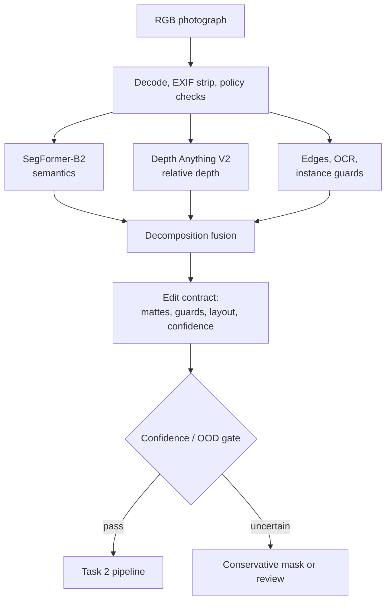

# Task 1: Attribute Detection and Decomposition

## Architecture

The output contract has soft masks for `sky`, `atmosphere`, `weather_surface`, and `structure_guard`, plus per-pixel confidence: *where weather can manifest* versus *what cannot move*. The generator never sees these masks; a verifier uses them to score and gate candidates after generation. The same segmenter also produces a compact `SceneLayout` (protected instances, water, sky) for the source and each candidate, so the verifier can catch semantic drift — appeared people, water turned to land, new water over solid ground — that photometric metrics miss.

## Model choice and trade-offs

**Baseline: SegFormer-B2 + Depth Anything V2 Small.** SegFormer's ADE20K labels already separate sky and weather-receptive surfaces (road, grass, earth, roof); B2 is the accuracy/latency sweet spot, B0 the edge fallback, B5 the server option. Depth is essential because fog strength must grow with distance rather than act as a flat overlay.

| Option | Strength | Limitation | Decision |
|---|---|---|---|
| SegFormer | Efficient dense semantics; mature TensorRT path | Closed label set; thin objects imperfect | Primary runtime model |
| Mask2Former/OneFormer | Strong boundaries, panoptic instances | Higher latency/memory | Offline teacher, hard-case fallback |
| Promptable segmentation | Fast adaptation to new concepts | Needs prompts; no weather ontology | Annotation accelerator only |
| Depth Anything V2 | Cheap zero-shot relative depth | Scale/orientation ambiguous | Fuse with sky/ground priors; never metric |
| Weather classifier | Cheap OOD and current-weather label | No localization | Auxiliary confidence head |

Production: segmentation and depth run in parallel, exported to TensorRT FP16/INT8, decomposition cached by content hash. Constrained devices swap in B0 at lower resolution; uncertain boundaries become less editable. Latency numbers are release gates measured on the L4, not model-card claims.

## Automatic decomposition

Semantic logits map into causal weather layers:

- `sky`: sky posterior, restricted to top-connected components.
- `weather_surface`: terrain classes that can become wet or hold snow (mountain, rock, roof, earth, road, vegetation). A learned material/orientation head eventually replaces this class list.
- `atmosphere`: relative far-depth likelihood — drives fog and distant contrast.
- `structure_guard`: static edges plus person/vehicle/text/sign instances. Edges inside sky and water are excluded as transient texture. OCR polygons and face/plate detections are hard guards in production.
- `confidence`: calibrated segmentation confidence times in-distribution and quality scores.

The fusion in `decomposition.py` builds two mattes per target $w$ from global support $g_w$, semantic supports $S$, and confidence $C$:

$$
M_w = \mathrm{blur}\left(g_w + (1-g_w)\max(\alpha_w S_{sky},\beta_w S_{surface},\gamma_w S_{far})C\right),
\qquad
R_w = \mathrm{blur}\left(\max(\hat\alpha_w S_{sky},\hat\beta_w S_{surface},\hat\gamma_w S_{far})C\right).
$$

The global floor $g_w$ exists because weather changes illumination everywhere. $M_w$ licenses appearance change — change weighted by its complement is leakage. $R_w$ licenses new spatial texture (particles, clouds, accumulation) — texture outside it, like an invented object or a frozen patch in open water, is a violation even when the illumination shift is legitimate. The structure guard $G$ marks where candidate edges must coincide with source edges; violating candidates are rejected, not repainted.

The split is automatic (no per-image labeling) and the production successor learns the fusion head from weak labels: aligned before/after pairs supervise editable regions through exposure-compensated difference masks, while unchanged DINO features and flow-consistent edges supervise preservation. A small gold set calibrates.

## Data strategy

1. License adverse-weather/driving datasets plus consented outdoor photography; stratify by geography, scene, camera, day/night, target weather, and people/vehicle presence.
2. Hand-label 2,000–5,000 diverse frames (sky, receptive surfaces, protected instances, ambiguity flags); double-label the hardest 15%.
3. Pseudo-label the larger pool with a panoptic + depth + OCR ensemble; keep soft posteriors, drop low-agreement examples.
4. Mine aligned webcam/burst pairs; exposure-compensated difference masks give weak editable-region supervision.
5. Render physical fog/rain/snow over synthetic scenes with exact masks, but keep real data at ≥50% of batches to prevent texture shortcuts.
6. Actively sample high-entropy, gate-failure, and rare-stratum cases; prevent scene leakage across splits.

## Failure modes and handling

| Failure | Detection | Handling |
|---|---|---|
| White building merges with overcast sky | Boundary disagreement; top-connectivity; depth discontinuity | Refine with panoptic fallback; erode edit mask; review if large |
| Reflections/puddles confused with sky | Semantic class and vertical position conflict | Keep as surface response, never sky |
| Fog hides distant objects | Low contrast/OOD score; uncertain depth | Lower edit strength and preserve edges; permit photometric attenuation but no geometry change |
| Snow on thin branches or signs | High edge/OCR overlap | Guard text and branch topology; feather accumulation behind guard |
| Occluded people/vehicles | Instance confidence or truncated boundary | Expand hard guard and reject identity-sensitive failures |
| Indoor/window scene | Scene classifier and sky not top-connected | Segment panes separately or reject unsupported input |
| Night, infrared, extreme HDR | OOD embedding and quality checks | Route to specialist model; do not silently apply daytime priors |
| Multiple weather attributes entangled | Classifier disagreement and low target margin | Represent weather as a vector; edit one controlled target while preserving time-of-day |

## Privacy and retention

EXIF/GPS is stripped at ingress; perception and generation run locally, never through third-party APIs. Raw images and reversible latents live encrypted in a short-lived store and are deleted at job TTL. Masks, embeddings, depth, and OCR boxes still reveal silhouettes and identifiers, so they inherit the raw-image access policy — they are not anonymous. Logs keep model versions, coarse metrics, and salted job IDs only. Face/plate embeddings exist only during preservation gating, then are discarded.