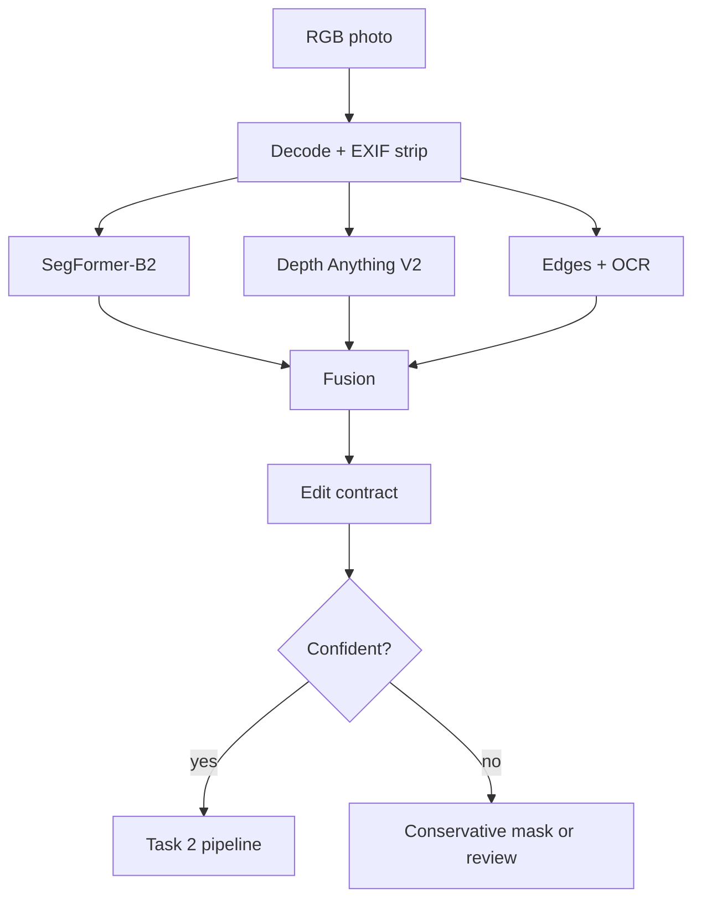

# Task 1: Attribute Detection and Decomposition

## Architecture

The edit contract is a set of soft masks — `sky`, `atmosphere`, `weather_surface`, `structure_guard` — plus per-pixel confidence. Together they say *where weather can show up* and *what must not move*. The generator never sees these masks; they exist for the verifier, which scores and rejects candidates after generation. The segmenter also produces a small `SceneLayout` (people/vehicles, water, sky) for the source and every candidate, so the verifier can catch what pixel metrics miss: an added person, water turned into land, a new pond.

## Model choice and trade-offs

**Baseline: SegFormer-B2 + Depth Anything V2 Small.** SegFormer's ADE20K labels already separate sky from weather-receptive surfaces (road, grass, earth, roof). B2 is the accuracy/latency sweet spot; B0 is the edge fallback, B5 the server option. Depth matters because fog should get thicker with distance, not sit on the image like a flat veil.

| Option | Strength | Limitation | Decision |
|---|---|---|---|
| SegFormer | Efficient dense semantics; mature TensorRT path | Closed label set; thin objects imperfect | Primary runtime model |
| Mask2Former/OneFormer | Strong boundaries, panoptic instances | Higher latency/memory | Offline teacher, hard-case fallback |
| Promptable segmentation | Fast adaptation to new concepts | Needs prompts; no weather ontology | Annotation accelerator only |
| Depth Anything V2 | Cheap zero-shot relative depth | Scale/orientation ambiguous | Fuse with sky/ground priors; never metric |
| Weather classifier | Cheap check for current weather and unusual inputs | No localization | Auxiliary confidence head |

In production, segmentation and depth run in parallel as TensorRT FP16/INT8 engines, and decompositions are cached by content hash. Small devices use B0 at lower resolution and get more conservative masks. Latency is measured on the L4 before release, not taken from model cards.

## Automatic decomposition

The semantic classes map into weather layers:

- `sky`: sky pixels, limited to regions connected to the top of the frame.
- `weather_surface`: terrain that can get wet or hold snow (mountain, rock, roof, earth, road, vegetation).
- `atmosphere`: how far away each pixel is — drives fog strength and distant contrast.
- `structure_guard`: static edges plus person/vehicle/text/sign instances. Edges inside sky and water don't count — they are transient texture. OCR polygons and face/plate boxes become hard guards in production.
- `confidence`: segmentation confidence times an image-quality score.

`decomposition.py` fuses these into two mattes per target $w$ from global support $g_w$, semantic supports $S$, and confidence $C$:

$$
M_w = \mathrm{blur}\left(g_w + (1-g_w)\max(\alpha_w S_{sky},\beta_w S_{surface},\gamma_w S_{far})C\right),
\qquad
R_w = \mathrm{blur}\left(\max(\hat\alpha_w S_{sky},\hat\beta_w S_{surface},\hat\gamma_w S_{far})C\right).
$$

The global floor $g_w$ is there because weather changes lighting everywhere, not just in the sky. $M_w$ says where appearance change is allowed — change outside it counts as leakage. $R_w$ says where genuinely new texture (particles, clouds, snow cover) is allowed — new texture outside it, like an invented object or a frozen patch of sea, fails verification even if the lighting change is fine. The structure guard marks edges that must stay put; candidates that move them are rejected.

Nothing is hand-labeled at runtime — the split comes entirely from the models. Later, the fusion can be learned from weak labels: photo pairs of the same place in different weather show which regions actually change, and everything that stays put supervises preservation. A small hand-checked set is enough to calibrate.

## Data strategy

1. License adverse-weather and driving datasets plus consented outdoor photos, covering a good mix of regions, scene types, cameras, day/night, and weather.
2. Hand-label 2,000–5,000 diverse frames; have the hardest 15% labeled twice.
3. Pseudo-label a larger pool with an ensemble (panoptic segmentation, depth, OCR); drop images where the models disagree.
4. Collect webcam and burst photos of the same scene in different weather — after exposure correction, their differences show which regions weather actually changes.
5. Render synthetic fog/rain/snow with exact masks, but keep at least half of every batch real so the model doesn't learn synthetic texture quirks.
6. Feed failures back in: cases the gates rejected, cases the model was unsure about, and whatever is underrepresented. Never let the same scene appear in both train and test.

## Failure modes and handling

| Failure | Detection | Handling |
|---|---|---|
| White building merges with overcast sky | Boundary disagreement; top-connectivity; depth discontinuity | Refine with panoptic fallback; erode edit mask; review if large |
| Reflections/puddles confused with sky | Semantic class and vertical position conflict | Keep as surface response, never sky |
| Fog hides distant objects | Low contrast; uncertain depth | Lower edit strength and preserve edges; allow lighting change but no geometry change |
| Snow on thin branches or signs | High edge/OCR overlap | Guard text and branch topology; feather accumulation behind guard |
| Occluded people/vehicles | Instance confidence or truncated boundary | Expand hard guard and reject identity-sensitive failures |
| Indoor/window scene | Scene classifier and sky not top-connected | Segment panes separately or reject unsupported input |
| Night, infrared, extreme HDR | Unusual-input and quality checks | Route to a specialist model; do not silently apply daytime priors |
| Multiple weather attributes entangled | Classifier disagreement and low target margin | Represent weather as a vector; edit one controlled target while preserving time-of-day |

## Privacy and retention

EXIF/GPS is stripped at ingress, and everything runs locally — no third-party APIs. Raw images and latents are stored encrypted and deleted when the job expires. Masks, embeddings, depth, and OCR boxes still reveal silhouettes and identifiers, so they get the same access policy as the raw image — they are not anonymous. Logs contain model versions, metrics, and salted job IDs, nothing else. Face/plate embeddings only exist while the preservation check runs.