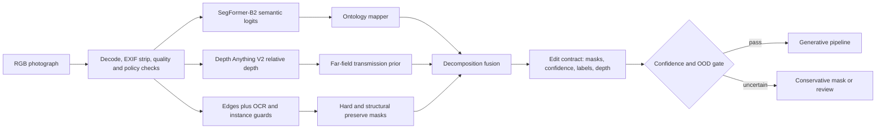

# Task 1: Attribute Detection and Decomposition

## Architecture

The output contract contains soft masks for `sky`, `atmosphere`, `weather_surface`, and `structure_guard`, plus per-pixel confidence. It separates *where weather can manifest* from *what cannot move*. The generator receives the source and a controlled instruction; the compositor later uses this contract to enforce preservation.

## Model choice and trade-offs

**Chosen baseline.** SegFormer-B2 provides a hierarchical transformer encoder and lightweight MLP decoder. ADE20K labels already distinguish sky and weather-receptive classes such as road, grass, earth, sidewalk, and field. B2 is a pragmatic accuracy/latency point; B0 is the edge fallback and B5 is the server-quality option. Depth Anything V2 Small adds a 24.8M-parameter DINOv2-backed relative-depth estimate. Depth is essential because fog is a field whose strength should increase with distance, not a flat image overlay.

| Option | Strength | Limitation | Decision |
|---|---|---|---|
| SegFormer | Efficient dense semantics; mature ONNX/TensorRT path | Closed ADE label set; thin objects are imperfect | Primary semantic model, fine-tuned on weather data |
| Mask2Former/OneFormer | Strong boundaries and panoptic instances | Higher latency/memory | Offline teacher and hard-case fallback |
| Promptable segmentation | Fast adaptation to new concepts | Requires prompts/detector and lacks weather ontology | Annotation accelerator, not sole runtime model |
| Depth Anything V2 | Strong zero-shot relative depth at low cost | Scale and orientation are ambiguous | Fuse with sky/ground priors; never use as metric depth |
| Image-level weather classifier | Cheap OOD and current-weather label | No localization | Auxiliary confidence and evaluation head |

The production profile runs segmentation and depth in parallel, exports them to TensorRT at FP16/INT8 after calibration, and caches decomposition by content hash. On constrained devices, SegFormer-B0 plus a quantized depth model produces the same contract at lower resolution; uncertain boundaries become less editable. Server batches group images by aspect bucket. Exact latency and throughput are release gates to be measured on L4, not inferred from model-card claims.

## Automatic decomposition

The ontology maps semantic logits into causal weather layers:

- `sky`: sky posterior, boundary-refined and restricted to top-connected components unless an indoor/open-roof case is detected.
- `weather_surface`: ground and exposed terrain classes that can become wet or accumulate snow, including mountain, hill, rock, roof, earth, road, and vegetation. A learned material/orientation head eventually replaces this ADE-derived class list.
- `atmosphere`: relative far-depth likelihood, regularized by sky and horizon. This controls fog and distant contrast.
- `structure_guard`: static Canny/learned boundaries plus person, vehicle, text, sign, and logo instances. Edges inside sky and water are excluded as transient texture; their boundaries remain guarded. OCR polygons and face/plate detections are hard guards in production.
- `confidence`: calibrated segmentation confidence multiplied by in-distribution and image-quality scores.

The critical fusion is implemented in `decomposition.py`. For target $w$, the prototype combines global weather support $g_w$ with stronger semantic support:

$$
M_w = \operatorname{blur}\left(g_w + (1-g_w)\max(\alpha_w S_{sky},\beta_w S_{surface},\gamma_w S_{far})C\right).
$$

The global term is essential: weather changes illumination and color across the frame, and snow can accumulate on many materials beyond a fixed ground-class list. Structure is therefore not removed from $M_w$. Instead, the compositor restores source high-frequency detail around $G$ while retaining the candidate's low-frequency weather appearance. This preserves edge location without freezing the original lighting at those pixels.

A second, narrower generation matte excludes the global floor:

$$
R_w = \operatorname{blur}\left(\max(\hat\alpha_w S_{sky},\hat\beta_w S_{surface},\hat\gamma_w S_{far})C\right).
$$

$M_w$ controls geometry-preserving color and illumination transfer across the image; $R_w$ controls where raw generated spatial content may enter. This prevents a model-invented foreground object or frozen patch from appearing in water while still allowing the water color and contrast to respond to snowy illumination.

This is interpretable and testable. The production successor learns the fusion head from paired change masks while retaining explicit channels and monotonic constraints. Weak labels come from aligned before/after imagery: unchanged DINO features and optical-flow-consistent edges supervise preservation; changed, weather-correlated regions supervise edit support. A small gold set calibrates rather than hand-labeling every image.

## Data strategy

1. Assemble licensed adverse-weather and driving-scene datasets plus consented general outdoor photography. Stratify by geography, urban/rural scene, camera, day/night, target weather, and people/vehicle presence.
2. Label 2,000-5,000 diverse frames with sky, receptive surfaces, hard-protected instances, horizon, weather, and ambiguity flags. Double-label the 15% hardest examples and adjudicate boundary disagreements.
3. Produce pseudo-labels on the larger pool using an ensemble of panoptic segmentation, depth, OCR, and promptable segmentation. Keep soft posteriors; discard low-agreement examples.
4. Mine naturally aligned webcam/burst pairs and geometrically register them. Difference masks after exposure compensation provide weak editable-region supervision.
5. Add physically rendered fog, rain, and snow over depth-equipped synthetic scenes, then keep real data dominant in validation and at least 50% of fine-tuning batches to prevent synthetic texture shortcuts.
6. Use active learning on high entropy, model disagreement, preservation-gate failures, and rare strata. Track source licenses and prevent scene-level leakage across splits.

## Failure modes and handling

| Failure | Detection | Handling |
|---|---|---|
| White building merges with overcast sky | Boundary disagreement; top-connectivity; depth discontinuity | Refine with panoptic fallback; erode edit mask; review if large |
| Reflections/puddles confused with sky | Semantic class and vertical position conflict | Keep as surface response, never sky |
| Fog hides distant objects | Low contrast/OOD score; uncertain depth | Lower edit strength and preserve edges; permit photometric attenuation but no geometry change |
| Snow on thin branches or signs | High edge/OCR overlap | Guard text and branch topology; feather accumulation behind guard |
| Occluded people/vehicles | Instance confidence or truncated boundary | Expand hard guard and reject identity-sensitive failures |
| Indoor/window scene | Scene classifier and sky not top-connected | Segment panes separately or reject unsupported input |
| Night, infrared, extreme HDR | OOD embedding and quality checks | Route to specialist model; do not silently apply daytime priors |
| Multiple weather attributes entangled | Classifier disagreement and low target margin | Represent weather as a vector; edit one controlled target while preserving time-of-day |

## Privacy and retention

Decode and policy checks happen in the trusted ingress service; EXIF/GPS is stripped immediately. Perception and generation are local. Raw images and reversible latents are encrypted in a short-lived object store and deleted after the configured job TTL. Masks, embeddings, depth, OCR boxes, and generator latents still reveal silhouettes, scene layout, or identifiers, so they inherit the raw image access policy and are not treated as anonymous. Logs contain model versions, coarse metrics, and salted job IDs, never pixels or prompts with user metadata. Face/plate embeddings are computed only when required for a preservation probe and discarded after gating.