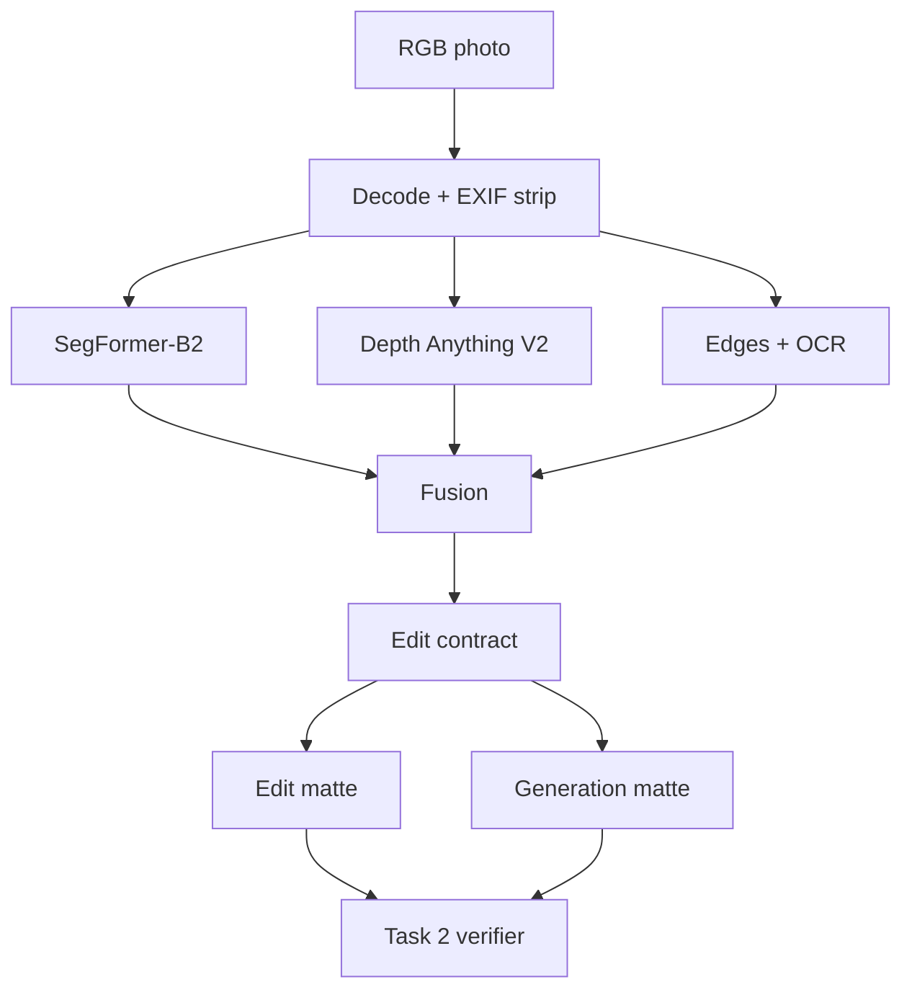

# Task 1: Attribute Detection and Decomposition

## Architecture

The output is an edit contract with four soft masks (`sky`, `atmosphere`, `weather_surface`, and `structure_guard`), a confidence score for each pixel, and two weather-specific mattes. The generator never sees this contract; the verifier uses it to score and reject generated candidates.

**Scope.** The architecture above is the production design. The prototype implements SegFormer + Depth Anything (or a weight-free heuristic fallback), edge guards, soft mattes, and semantic re-segmentation. OCR, instance matching, the weather classifier, TensorRT export, and specialist out-of-distribution routing are specified production components, not implemented prototype features.

## How decomposition works

1. **Segment the scene.** SegFormer assigns each pixel a scene class, such as sky, road, water, person, or vehicle, and reports how confident it is.
2. **Group the classes.** Sky becomes the `sky` mask. Roads, roofs, vegetation, and other weather-receptive terrain become the `weather_surface` mask.
3. **Estimate distance.** Depth Anything produces relative depth. This becomes the `atmosphere` mask, with stronger values for distant regions where fog should have more effect.
4. **Protect structure.** Image edges and protected objects form the `structure_guard`. OCR adds signs and other text in production so they remain readable. Edges in sky and water are ignored because those textures naturally change.
5. **Make soft masks.** Mask boundaries are blurred instead of being hard cutoffs. SegFormer's maximum class probability supplies a useful uncertainty signal, but it is not calibrated probability of correctness; distribution shift can still produce confident errors.
6. **Build weather-specific mattes.** The target weather determines how much sky, surface, and distance matter. Confidence reduces support in uncertain regions. The **edit matte** allows appearance changes such as brightness and color; the stricter **generation matte** allows new detail such as rain, clouds, fog, or snow cover.

The implemented masks and scores are produced automatically at runtime; no user annotation is required.

## How verification uses the contract

1. **Re-analyze the candidate.** Production runs segmentation, OCR, and instance matching on each candidate. The prototype re-runs semantic segmentation only.
2. **Check allowed changes.** The prototype measures appearance change inside and outside the **edit matte**. The **generation matte** is exported for inspection but is not yet enforced because that requires a detector that separates new weather detail from lighting change.
3. **Check preservation.** The prototype compares guarded edges and class-map area drift for protected classes and water. Production adds OCR equality, instance correspondence, and identity embeddings; these are needed to support object-count, text, and identity claims reliably.
4. **Select or reject.** The prototype applies visible-edit and semantic-drift gates, then ranks survivors by its transparent preservation score. Production adds a target-weather classifier and a learned artifact/realism scorer calibrated against human ratings.

## Model choice and trade-offs

**Baseline: SegFormer-B2 + Depth Anything V2 Small.** SegFormer's ADE20K labels already separate sky from weather-receptive surfaces (road, grass, earth, roof). B2 is the accuracy/latency sweet spot; B0 is the edge fallback, B5 the server option. Depth matters because fog should get thicker with distance, not sit on the image like a flat veil.

| Option | Strength | Limitation | Decision |
| --- | --- | --- | --- |
| SegFormer | Efficient dense semantics; mature TensorRT path | Closed label set; thin objects imperfect | Primary runtime model |
| Mask2Former/OneFormer | Strong boundaries, panoptic instances | Higher latency/memory | Offline teacher, hard-case fallback |
| SAM 3 | Strong promptable/open-vocabulary masks; adapts to new concepts | Needs prompts and rules to turn masks into scene categories; higher, less predictable runtime cost | Annotation accelerator, offline teacher, or hard-case fallback |
| Depth Anything V2 | Cheap zero-shot relative depth | Scale/orientation ambiguous | Fuse with sky/ground priors; never metric |
| Weather classifier | Cheap check for current weather and unusual inputs | No localization | Production auxiliary head; absent from prototype |

SegFormer is preferred for runtime because its one-pass semantic map maps directly into the weather ontology. SAM 3 helps with missing concepts and difficult boundaries, but requires prompts, rules for missing or overlapping masks, and separate confidence calibration, so it remains a supporting model.

In production, segmentation and depth would run in parallel as TensorRT FP16/INT8 engines, and decompositions would be cached by content hash. Small devices use B0 at lower resolution and get more conservative masks. These deployment optimizations are targets; release latency and peak VRAM must be measured on the L4 rather than inferred from model cards.

## Data strategy

1. License adverse-weather and driving datasets plus consented outdoor photos, covering a good mix of regions, scene types, cameras, day/night, and weather.
2. Hand-label 2,000–5,000 diverse frames; have the hardest 15% labeled twice.
3. Pseudo-label a larger pool with an ensemble (panoptic segmentation, depth, OCR); drop images where the models disagree.
4. Collect webcam and burst photos of the same scene in different weather. After exposure correction, their differences show which regions weather actually changes.
5. Render synthetic fog/rain/snow with exact masks, but keep at least half of every batch real so the model doesn't learn synthetic texture quirks.
6. Feed failures back in: cases the gates rejected, cases the model was unsure about, and whatever is underrepresented. Never let the same scene appear in both train and test.

## Failure modes and handling

| Failure | Detection | Handling |
| --- | --- | --- |
| White building merges with overcast sky | Boundary disagreement; top-connectivity; depth discontinuity | Refine with panoptic fallback; erode edit mask; review if large |
| Reflections/puddles confused with sky | Semantic class and vertical position conflict | Keep as surface response, never sky |
| Fog hides distant objects | Low contrast; uncertain depth | Lower edit strength and preserve edges; allow lighting change but no geometry change |
| Snow on thin branches or signs | High edge/OCR overlap | Guard text and branch topology; feather accumulation behind guard |
| Occluded people/vehicles | Instance confidence or truncated boundary | Expand hard guard and reject identity-sensitive failures |
| Indoor/window scene | Scene classifier and sky not top-connected | Segment panes separately or reject unsupported input |
| Night, infrared, extreme HDR | Unusual-input and quality checks | Route to a specialist model; do not silently apply daytime priors |
| Multiple weather attributes entangled | Classifier disagreement and low target margin | Represent weather as a vector; edit one controlled target while preserving time-of-day |

## Privacy and retention

EXIF/GPS is stripped at ingress, and everything runs locally with no third-party APIs. Raw images and latents are stored encrypted and deleted when the job expires. Masks, embeddings, depth, and OCR boxes can still reveal silhouettes and identifiers, so they get the same access policy as the raw image. They are not anonymous. Logs contain model versions, metrics, and salted job IDs, nothing else. Face/plate embeddings only exist while the preservation check runs.
