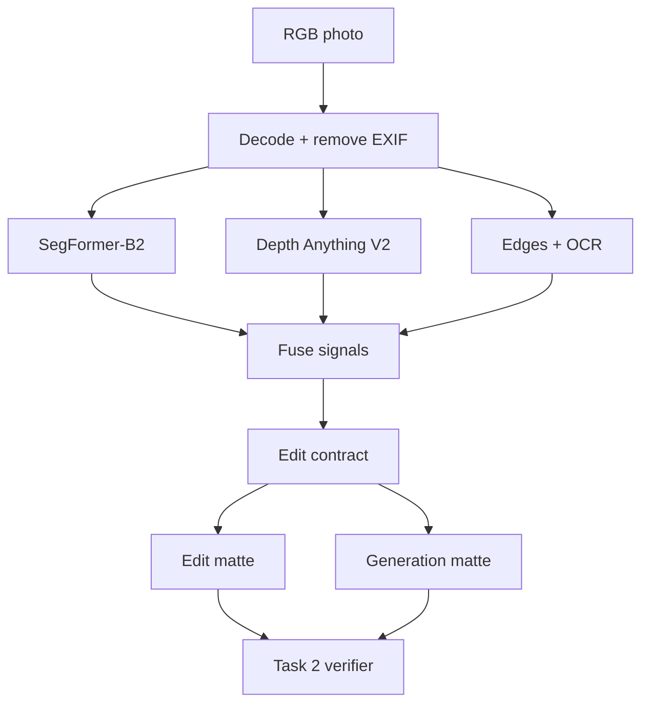

# Task 1: Understanding What May Change

Before changing the weather, the system needs a map of the scene. It must know where weather belongs and what must stay untouched.

## Architecture

The result is an **edit contract**: soft masks that describe where change is reasonable.

| Output | Meaning |
| --- | --- |
| `sky` | Clouds, sky color, and precipitation may change here. |
| `weather_surface` | Roads, roofs, soil, and plants may look wet or snowy. |
| `atmosphere` | Distant areas may lose contrast in fog. |
| `structure_guard` | Important edges, objects, and text should stay fixed. |
| `confidence` | How certain the segmentation model is at each pixel. |

The **edit matte** allows broad appearance changes such as lighting. The stricter **generation matte** marks where new detail, such as snow or rain, should appear. The generator does not see either mask; they are used to check its output.

> **Prototype scope:** the code implements SegFormer, Depth Anything, edge guards, soft masks, and re-segmentation. OCR, instance matching, unusual-input detection, and TensorRT deployment are production additions.

## From photo to edit contract

1. **Name each region.** SegFormer labels pixels as sky, road, water, person, vehicle, and so on.
2. **Estimate distance.** Depth Anything gives relative depth, which helps fog grow stronger with distance.
3. **Protect structure.** Strong edges and protected classes form the guard mask. Production OCR also protects signs and text.
4. **Blend uncertain boundaries.** Soft edges avoid visible seams. Low confidence reduces permission to edit.

Confidence is a warning signal, not proof. A model can still be confidently wrong on a new camera or unusual scene.

## How candidates are checked

Each generated candidate is compared with the source:

- Did enough change inside the edit area?
- Did too much change outside it?
- Did guarded edges move or disappear?
- Did people, vehicles, water, or land appear in new places?

The prototype uses pixel change, edge similarity, and semantic masks. Production adds OCR, object-instance matching, and identity embeddings. Those additions are needed before claiming that text, object count, or identity is truly preserved.

## Model choice and trade-offs

**SegFormer-B2 + Depth Anything V2 Small** is the baseline. SegFormer is fast and already recognizes the main weather regions. Depth keeps fog from looking like a flat gray overlay.

| Option | Strength | Limitation | Decision |
| --- | --- | --- | --- |
| SegFormer | Fast scene segmentation | Fixed labels; weak on thin objects | Runtime model |
| Mask2Former / OneFormer | Better boundaries and object instances | More memory and latency | Teacher or fallback |
| SAM 3 | New concepts and difficult masks | Needs prompts and extra rules | Labeling tool or fallback |
| Depth Anything V2 | Fast relative depth | Not metric depth | Fog and distance signal |
| Weather classifier | Current weather and unusual inputs | Does not localize | Production confidence check |

On an L4, segmentation and depth can run in parallel. A production build would use FP16/INT8 TensorRT engines and cache the result. Small devices would use SegFormer-B0 at lower resolution and more conservative masks. Latency and memory still need end-to-end measurement.

## Data strategy

1. Start with licensed weather datasets and consented outdoor photos. Cover different regions, cameras, times of day, and weather.
2. Hand-label 2,000–5,000 varied frames. Label difficult examples twice, then pseudo-label a larger pool with stronger models.
3. Add same-place photos taken in different weather. They show what weather changes in the real world.
4. Add synthetic rain, fog, and snow for exact masks, but keep at least half of each batch grounded in real photos.
5. Feed rejected and low-confidence cases back into training. Split by location so the same scene never appears in training and evaluation.

## Failure modes and handling

| Failure | Detection | Handling |
| --- | --- | --- |
| White building mistaken for sky | Boundary and depth disagree | Shrink the mask or use a stronger segmenter |
| Reflection mistaken for sky | Class conflicts with image position | Treat it as a surface, never sky |
| Fog hides a distant object | Low contrast and uncertain depth | Reduce edit strength; preserve its edges |
| Snow covers a sign or branch | Snow overlaps text or thin edges | Protect the shape and place snow behind it |
| Person or vehicle is partly hidden | Low-confidence object boundary | Expand the guard or reject the edit |
| Indoor view through a window | Sky is not connected to the top | Handle the window separately or reject |
| Night, infrared, or extreme HDR | Input-quality check flags a shift | Route to a specialist model |
| Weather and time of day are mixed | Weather classifiers disagree | Change one weather target; preserve time of day |

## Privacy and retention

EXIF and GPS are removed at entry, and inference stays local. Raw photos and temporary latents are encrypted and deleted when the job expires. Masks, depth maps, OCR boxes, and embeddings may still reveal people or places, so they follow the same access rules as the source. Logs keep only model versions, metrics, and salted job IDs.
