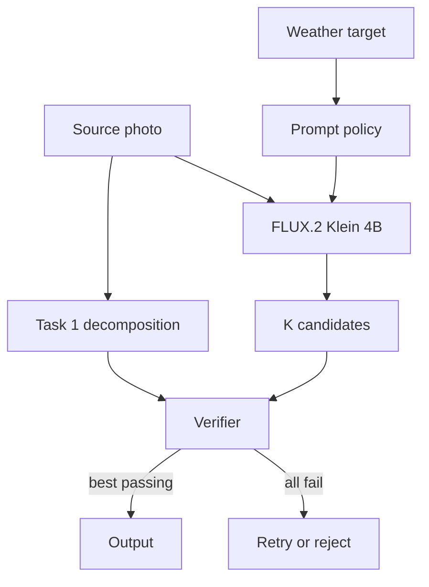

# Task 2: Changing Weather Without Changing the Scene

The editor has one job: make the requested weather obvious while keeping the photograph recognizable as the same scene.

## The pipeline

The selected model is [`black-forest-labs/FLUX.2-klein-4B`](https://huggingface.co/black-forest-labs/FLUX.2-klein-4B). It is a 4B rectified-flow transformer with image editing, four-step inference, and an Apache 2.0 license.

Its model card reports about 13 GiB VRAM, leaving room on a 24 GiB L4. Peak memory must still be measured with the perception models running.

This is a practical starting point, not a claim that FLUX is always best. Qwen-Image-Edit-2511 is larger and uses 40 steps in its reference setup. FLUX.1 Kontext and Klein 9B use non-commercial model licenses.

## Family comparison

| Approach | Edit control | Preservation | Cost | Assessment |
| --- | --- | --- | --- | --- |
| Inpainting | Precise masked edits | Exact outside the mask; boundary seams | Many steps | Good sky-only baseline |
| ControlNet-style conditioning | Holds depth and edges | Needs another model and training | Extra runtime cost | Add if geometry drifts |
| Rectified-flow editor | Handles global weather and local detail together | Can change unrelated content | Four steps | Selected generator |
| Large multimodal editor | Strong instruction following | Too large or slow for an L4 | High | Offline comparison model |

## Generate, verify, select

The source image conditions the model, but no spatial mask is passed to it. Every output pixel comes from the model.

1. **Generate:** create four candidates with fixed prompts and different seeds.
2. **Verify:** compare each candidate with the Task 1 edit contract.
3. **Select:** return the best candidate that passes every gate. If all fail, write no output; a service may retry once before rejecting the request.

The prototype checks visible change, edge similarity, change outside the edit area, and movement in semantic masks. It cannot prove that object identity or count stayed fixed; production needs instance matching and OCR for that.

Semantic masks matter because pixel difference alone cannot tell useful snow from a shoreline that moved.

**Prompt lesson.** Short prompts worked better for rain and fog in early tests because long descriptions introduced unwanted ponds. Snow needed one explicit rule: open water must remain liquid. These runs guided the current prompts but are not a benchmark; every prompt change must be tested on the held-out set.

The CLI provides a real `Flux2KleinEditor` and a deterministic, weight-free `MockWeatherEditor`. Both use the same verification path.

## Evaluation methodology

Evaluation uses held-out examples of all five weather types, the hard cases from Task 1, and human ratings. Results are reported by weather and scene type, not only as one average.

| Axis | Automated measurements | Human question |
| --- | --- | --- |
| Edit fidelity | Weather margin; CLIP margin; weather-specific probes | “Is the requested weather clear?” |
| Preservation | Edge F1; segment, OCR, and identity checks | “Is this still the same scene?” |
| Realism | KID/FID; artifact detector; pairwise preference | “Could this be a real photo?” |
| Safety | Policy checks; protected-content drift; provenance | “Could this mislead someone?” |

The prototype implements weighted pixel change, edge F1, and three semantic-drift measures. Weather classification, OCR/identity checks, KID/FID, artifact detection, and human ratings belong to the release evaluation.

### How the winner is chosen

Use **gates first, ranking second**. A realistic storm cannot make up for a changed person or shoreline.

**Prototype policy.** Reject a candidate unless all four measured gates pass:

| Gate | Threshold | Meaning |
| --- | ---: | --- |
| Edit support MAE | $\ge 0.02$ | The intended area changed visibly; this does not prove the weather is correct. |
| Protected-class gain | $\le 0.001$ of image pixels | Little new person, vehicle, or sign area appeared. |
| Source-water loss | $\le 0.03$ of source water | Water did not become non-water/non-sky. |
| New-water gain | $\le 0.02$ of image pixels | Solid ground did not become a large water region. |

Passing candidates are ranked by

$$S = F_{edge} - 2E_{outside} - 50D_{protected} - 8D_{water\ loss} - 8D_{water\ gain}.$$

The score rewards stable edges and penalizes change outside the edit area or in protected classes. Pixel identity is not a gate because weather can change lighting across the full image. The score does **not** measure realism or prove that the requested weather is correct.

In production, semantic, OCR, identity, weather, and safety checks remain hard gates. Only passing candidates are ranked for realism and edit strength.

Thresholds are tuned by weather and scene type, then frozen before comparing models. If nothing passes, retry within a fixed budget or reject. Never weaken preservation to get a stronger storm.

## Consistency across related inputs

For video or bursts, carry masks and initial noise across frames with optical flow, share the weather target over a short window, and detect cuts before reusing anything. Keep rain and snow particles consistent in 3D. For multiple photos of one place, verify weather consistency across views. The prototype handles single images only.

## Scalability and operations

- Keep perception and generation as long-running GPU workers; cache each decomposition for its encrypted job.
- Use an L4 for inference and A100/H100 GPUs for training or bulk evaluation. CPU offload is a slow compatibility mode.
- Queue by image size and limit work before GPU memory is exhausted.
- Test new versions on the frozen suite, release gradually, and roll back on quality, safety, or latency regressions.

With 10x less GPU, use SegFormer-B0, a lower resolution, one candidate, and an INT8 two-step student. Masked inpainting is a fallback for sky-only edits. For 5x lower latency, remove multi-seed selection and verify one candidate. Lower realism or more rejections are acceptable; weaker preservation gates are not.

## Misuse controls

Weather edits can fake storm or flood evidence, unsafe roads, or the conditions in which a photo was taken. The prototype limits users to five weather targets.

Production also needs content review, rate limits, audit logs, C2PA metadata, a watermark, and a clear synthetic-weather label. High-impact uses require purpose review and human approval. No watermark can make deceptive use safe.
