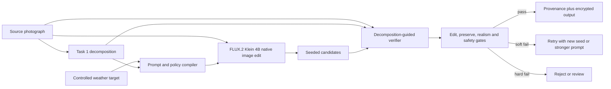

# Task 2: Selective Weather Editing

## Architecture and selected model

**Selected checkpoint:** [`black-forest-labs/FLUX.2-klein-4B`](https://huggingface.co/black-forest-labs/FLUX.2-klein-4B). As of 22 August 2026 it is the best deployment fit among the evaluated open-weight native editors: a 4B rectified-flow transformer with text-to-image, image-to-image, and multi-reference editing in one model; four-step distilled inference; Apache 2.0 licensing; and an official footprint of about 13 GiB VRAM. It therefore fits an L4 while leaving some room for the small perception models. The choice is an evaluation hypothesis, not an evergreen claim: every replacement must beat it on the frozen weather benchmark and operational gates.

The alternative 20B Qwen-Image-Edit-2511 has strong consistency and geometric reasoning but uses a 40-step reference path and does not fit an L4 in BF16 without aggressive quantization/offload. FLUX.1 Kontext is a capable 12B editor but is gated and non-commercial. FLUX.2 Klein 9B may improve quality but carries a non-commercial license and a less comfortable L4 footprint.

## Family comparison

| Approach | Edit control | Preservation | Cost | Assessment |
|---|---|---|---|---|
| Latent-diffusion inpainting | Excellent binary spatial control | Exact outside mask; seams at boundaries | Moderate, many denoising steps | Strong sky replacement baseline, weak for global illumination/fog |
| ControlNet-style depth/edge conditioning | Explicit geometry retention | Strong structure if controls are reliable | Extra network and domain training | Add if prompt plus verification cannot preserve geometry |
| Native rectified-flow transformer edit | Understands global instruction and image jointly | Strong semantic consistency, but can drift | Four steps for Klein | Selected candidate generator |
| Large autoregressive/multimodal editor | Strong instruction reasoning | Often strong identity/text behavior | Too large/slow for L4 | Offline teacher/evaluation comparator |

Rectified flow is justified despite not being a classic diffusion chain: it is a transformer-based generative family allowed by the brief, follows a straighter denoising trajectory, and reaches the target latency at four steps. The generator owns every output pixel. An earlier iteration composited candidate pixels back onto the source through the Task 1 mattes with bounded color transfer, deterministic tone curves, and guarded detail reinjection; it enforced preservation numerically but produced seams, halos, and tone breaks around structure — a "Photoshopped" look — because hand-tuned photometry fought the globally coherent illumination the editor had already synthesized. The redesign inverts the mattes' role from blend weights to a verification contract. The broad appearance matte defines where change is licensed and, through its complement, where change counts as leakage. The narrower generation matte defines where new spatial texture may appear. The structure guard defines where candidate edges must stay put. On top of the photometric checks, a semantic layout probe re-segments each candidate and measures drift against the source: appeared protected instances (people, vehicles, signs), source water turned solid, and new water over solid ground are hard gates, because MAE and edge metrics cannot distinguish "snow on water" from "new land". The pipeline generates a small set of seeded candidates, scores each against this contract, and returns the best passing candidate untouched: preservation is enforced by selection and rejection, never by repainting.

The edit instruction is a per-target policy tuned against the verifier, not a fixed template. A/B runs across seeds showed that a minimal instruction ("Keep everything the same, except that the weather is rainy.") preserved layout strictly better than a long constraint list for rain and fog — the constraint list's wetness clauses primed the model to invent ponds (4/4 seeds failed the water-gain gate), while the minimal prompt passed 4/4. Snow is the exception: the minimal prompt froze open sea on every seed (water-loss 0.87–1.0), so snow keeps explicit liquid-water and shoreline constraints (best water-loss 0.006). The lesson generalizes: negative instructions can induce the very content they forbid, so each constraint clause must earn its place on the verifier, per target.

Material response — diffuse cloud illumination on facades, wet-asphalt reflection, accumulation restricted to receptive surfaces — is delegated to the editor through target-specific prompt clauses rather than post-hoc tone curves. The verifier confirms the response happened where licensed. In production, a learned material-and-surface-orientation head would sharpen both the prompt policy and the target-specific verification thresholds, for example distinguishing upward-facing accumulation from vertical facades.

The submitted CLI exposes two editors. `Flux2KleinEditor` lazily loads the real Diffusers pipeline and invokes its native `image` input. `MockWeatherEditor` makes deterministic effects so reviewers can run all orchestration without weights. Both pass through identical decomposition, verification, candidate selection, debug export, and metrics.

## Evaluation methodology

Use a scene-disjoint set with real clear/rain/snow/fog/overcast strata, hard cases from Task 1, and licensed aligned sequences where available. Each source has all valid requested targets, a preservation ontology, and human acceptability labels. Report metrics by target, geography, scene type, protected-content presence, and OOD bucket, never only an average.

| Axis | Automated measurements | Human question |
|---|---|---|
| Edit fidelity | Calibrated weather-classifier target probability and margin; CLIP weather-text margin; rain/snow particle and wet-surface probes; monotonic fog transmission versus depth | “Is the requested weather unambiguous and physically coherent?” |
| Preservation | Tolerant edge F1/Chamfer around source structure; segment/box consistency; OCR exact match; face/object embedding similarity; material identity probes | “Is this unmistakably the same scene, camera, objects, people, and text?” |
| Realism | KID/FID against target-weather real sets at matched scene strata; no-reference artifact detector; blinded pairwise preference | “Could this be a real photograph, ignoring whether the event occurred?” |
| Safety | Input/output policy classifiers; protected-content drift; provenance presence | “Could this output be deceptive or harmful in context?” |

The included lightweight metrics report global appearance change, change weighted by strong and weak semantic support, tolerant edge F1 near source structure, and three layout-drift gates (protected-instance gain, water loss, water gain). They are smoke tests, not substitutes for learned probes.

### Managing the three-way trade-off

Treat model selection as a constrained Pareto problem rather than one weighted score. Begin with gates calibrated on human acceptability, for example: no OCR or object-count changes, edge displacement below a target-specific threshold, high source/output DINO correspondence, target-weather margin above a validated threshold, and no safety failure. Among passing candidates, rank realism and latency. Pixel identity is not a preservation gate for global weather because illumination, visibility, and material appearance should change across most of the frame.

At runtime generate a small seed batch (the demo uses four) and keep the best-verified candidate, preferring any gate-passing candidate over a higher-scoring failing one. If edit fidelity fails but preservation passes, strengthen the target prompt clause or increase conditioning. If preservation fails, retry a new seed or reject; do not trade identity for a stronger storm. If realism fails, retry once with a different seed. Store only metrics and selected seed after the retention window. Offline, publish the complete Pareto frontier of edit success, leakage, realism, p50/p95 latency, and peak VRAM.

## Consistency across related inputs

For bursts/video, estimate camera motion and optical flow, track instances, and fuse depth over time. Warp the previous decomposition and latent/noise initialization into the next frame, then use a short temporal window with shared weather embedding and precipitation trajectory. Add temporal losses on flow-warped non-occluded DINO features and edge maps. Re-render transient particles in camera/world coordinates instead of independently sampling each frame. Detect cuts and occlusions before propagation. For unordered views of one place, share a scene/weather ID and target embedding, align available geometry, and measure cross-view object embeddings and weather statistics. A single-image request does not claim temporal guarantees.

## Scalability and operations

- Package perception as TensorRT FP16/INT8 services and the BF16 four-step generator as a long-lived worker. Keep batch size one for interactive latency; use aspect buckets and small dynamic batches for offline jobs.
- An L4 is the deployment baseline because the model card reports roughly 13 GiB for FLUX.2 Klein 4B. Budget headroom is validated under concurrency. CPU offload is a compatibility mode, not the latency target.
- Cache only non-sensitive model artifacts globally. Cache decompositions per encrypted job, then delete them with source data. Queue by pixel count and target; apply backpressure before out-of-memory risk.
- Canary each model/engine version on the frozen evaluation suite, then 1%, 10%, and 50% traffic with automatic rollback on preservation, safety, latency, or OOM regression.
- An A100/H100 is warranted for fine-tuning, distillation, high-throughput evaluation, or 20B teacher comparisons. It is unnecessary for this inference proof of concept.

## Misuse controls

Weather editing can fabricate floods, fires’ atmospheric effects, unsafe roads, or extreme storms; manipulate insurance/news evidence; and conceal location or time. Restrict the API to enumerated weather controls, scan source and output for high-risk documentary contexts, rate-limit and audit abuse patterns, and block claims-oriented workflows such as evidence generation. Preserve signed source hashes and attach C2PA provenance plus model/version/edit-target metadata to output; use a robust pixel watermark as defense in depth. The UI must disclose that weather was synthesized. High-impact enterprise uses require purpose review and human approval. Watermarking does not make misuse safe, so policy enforcement and provenance verification remain primary.