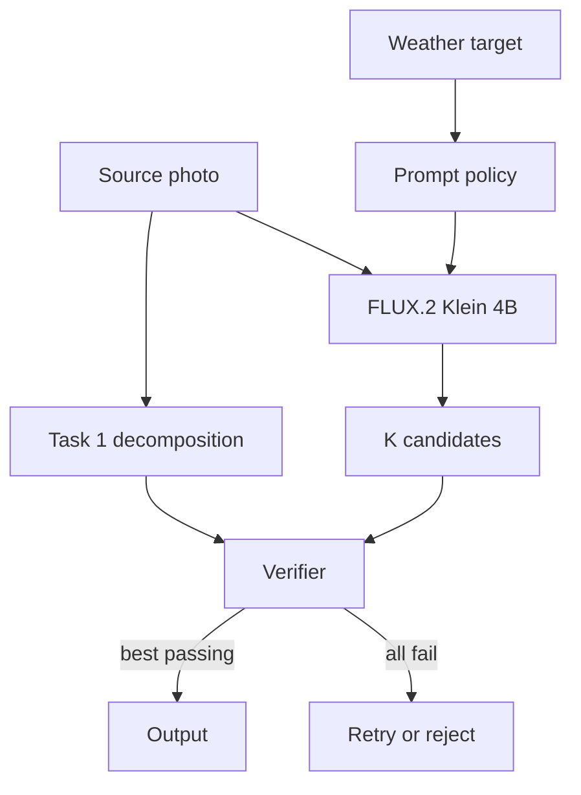

# Task 2: Selective Weather Editing

## Architecture and selected model

**Selected checkpoint:** [`black-forest-labs/FLUX.2-klein-4B`](https://huggingface.co/black-forest-labs/FLUX.2-klein-4B), a 4B rectified-flow transformer with native image editing, four-step inference, an Apache 2.0 license, and a model-card estimate of ~13 GiB VRAM. This leaves a plausible margin on a 24 GiB L4, but combined peak VRAM with perception must still be measured. Alternatives: Qwen-Image-Edit-2511 is 20B and its reference configuration uses 40 steps; FLUX.1 Kontext is 12B under a non-commercial model license, as is Klein 9B. This selection remains a benchmark hypothesis, not a claim of general superiority.

## Family comparison

| Approach | Edit control | Preservation | Cost | Assessment |
| --- | --- | --- | --- | --- |
| Latent-diffusion inpainting | Excellent binary spatial control | Exact outside mask; seams at boundaries | Moderate, many denoising steps | Strong sky replacement baseline, weak for global illumination/fog |
| ControlNet-style depth/edge conditioning | Explicit geometry retention | Strong structure if controls are reliable | Extra network and domain training | Add if prompt plus verification cannot preserve geometry |
| Native rectified-flow transformer edit | Understands global instruction and image jointly | Strong semantic consistency, but can drift | Four steps for Klein | Selected candidate generator |
| Large autoregressive/multimodal editor | Strong instruction reasoning | Often strong identity/text behavior | Too large/slow for L4 | Offline teacher/evaluation comparator |

## Generate, verify, select

Rectified flow is transformer-based (allowed by the brief) and uses four inference steps. This is full-frame conditional editing: the source image conditions the model, but no spatial mask is passed and every output pixel comes from the model.

1. **Generate** K candidates (the demo uses 4 seeds) from the photo, fixed target prompt, and deterministic seed.
2. **Verify** each one against the Task 1 contract. The prototype checks minimum visible change, guarded-edge similarity, leakage, and re-segmented area drift. Its protected-class gate detects newly occupied pixels, not object identity or count; production requires instance matching and OCR for those stronger guarantees.
3. **Select** the highest-ranked candidate that passes every hard gate. The CLI writes no output if all candidates fail; a service may retry once with new seeds before returning a structured rejection.

**Prompts.** Exploratory L4 runs used short and long variants. Short prompts preserved rain and fog scenes better in those runs; wetness instructions often introduced ponds. Snow needed explicit liquid-water constraints because the short variant froze open water. These observations motivated the fixed prompts in `editing.py`, but the small runs are not a benchmark. Prompt changes must be evaluated per target on the held-out suite because negative instructions can introduce the concept they are meant to prevent.

The CLI ships two editors behind one protocol: `Flux2KleinEditor` (real Diffusers pipeline) and `MockWeatherEditor` (deterministic, no weights), both running the same decomposition, verification, and selection.

## Evaluation methodology

Evaluate on a held-out set with real examples of all five weather types, the hard cases from Task 1, and human ratings. Report results per weather target and scene type, not just one average.

| Axis | Automated measurements | Human question |
| --- | --- | --- |
| Edit fidelity | Weather-classifier target margin; CLIP margin; precipitation/wet-surface probes; fog transmission vs. depth | “Is the requested weather unambiguous and coherent?” |
| Preservation | Edge F1 near structure; segment/OCR/identity consistency; layout-drift gates | “Is this unmistakably the same scene?” |
| Realism | KID/FID vs. real target-weather sets; artifact detector; pairwise preference | “Could this be a real photograph?” |
| Safety | Policy classifiers; protected-content drift; provenance presence | “Could this be deceptive in context?” |

The table is the release evaluation design. The prototype implements support-weighted MAE, edge F1, and three class-map drift measures; it does not implement weather classification, OCR/identity checks, KID/FID, an artifact detector, or human-rating collection. Its metrics are smoke tests, not evidence that all four axes are solved.

### Edit vs. preservation vs. realism

The decision is lexicographic, not one blended score: a realistic storm cannot compensate for a changed person or shoreline.

**Prototype policy.** Reject a candidate unless all four measured gates pass:

| Gate | Threshold | Meaning |
| --- | ---: | --- |
| Edit support MAE | $\ge 0.02$ | The licensed region changed visibly; this is only a proxy for correct weather. |
| Protected-class gain | $\le 0.001$ of image pixels | Segmentation found little new person/vehicle/sign occupancy. |
| Source-water loss | $\le 0.03$ of source water | Water did not become non-water/non-sky. |
| New-water gain | $\le 0.02$ of image pixels | Solid ground did not become a large water region. |

Passing candidates are ranked by

$$S = F_{edge} - 2E_{outside} - 50D_{protected} - 8D_{water\ loss} - 8D_{water\ gain}.$$

Here $F_{edge}$ rewards guarded-edge retention and the other terms penalize leakage and semantic drift. Pixel identity is not a gate because weather legitimately changes illumination across most of the frame. This score intentionally does **not** claim to measure realism or whether the target weather is semantically correct.

**Production policy.** Keep the semantic, OCR, identity, and safety checks as hard gates; add a calibrated target-weather margin as an edit-fidelity gate. Rank only the survivors by an artifact/realism model, target margin, and human-calibrated pairwise preference. Thresholds are set per weather and scene slice on validation data, then frozen before model comparison. If no candidate passes, retry within a fixed compute budget or reject; never relax a preservation gate to obtain a stronger edit.

## Consistency across related inputs

For video or bursts: estimate camera motion and optical flow, carry the decomposition and noise initialization from frame to frame, share the weather target across a short window, and keep particles consistent in 3D instead of re-rolling them per frame. Detect cuts before propagating anything. For unordered photos of one place, share the weather target and check consistency across views. Single images make no temporal promises.

## Scalability and operations

- Production targets TensorRT FP16/INT8 perception services and a long-lived BF16 four-step generator worker. Batch size one is the interactive default; small batches serve offline work.
- L4 is the inference baseline; CPU offload is a compatibility mode. A100/H100 only for training and bulk evaluation.
- Decompositions are cached per encrypted job and deleted with the source. Queue by pixel count; apply backpressure before running out of memory.
- New model versions go through the frozen suite, then staged traffic with automatic rollback on any preservation, safety, or latency regression.

With roughly 10x less GPU, use SegFormer-B0 at lower resolution, an INT8 two-step student, one candidate, and conservative rejection; restricted masked inpainting is the fallback for sky-only edits. For a 5x tighter latency target, remove multi-seed selection and spend the budget on one verified candidate. Lower realism or a higher rejection rate is acceptable; weaker preservation gates are not.

## Misuse controls

Weather editing can fabricate storm or flood evidence, unsafe road conditions, or hide when and where a photo was taken. The prototype implements only the fixed five-target interface. Production controls add documentary/evidentiary-content review, rate limits, audit logs, C2PA provenance, model/edit metadata, a watermark, and an explicit synthetic-weather disclosure. High-impact enterprise use needs purpose review and human approval. These controls are defense in depth; provenance and watermarks do not make deceptive use safe.
