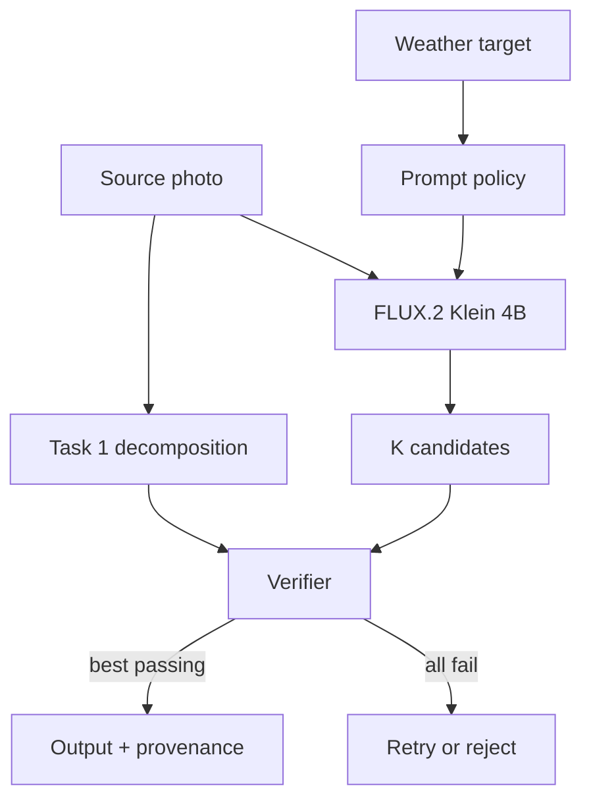

# Task 2: Selective Weather Editing

## Architecture and selected model

**Selected checkpoint:** [`black-forest-labs/FLUX.2-klein-4B`](https://huggingface.co/black-forest-labs/FLUX.2-klein-4B) — a 4B rectified-flow transformer with native image editing, four-step inference, an Apache 2.0 license, and a ~13 GiB footprint that fits an L4 next to the perception models. Alternatives: Qwen-Image-Edit-2511 (20B) is strong but needs 40 steps and doesn't fit an L4 in BF16; FLUX.1 Kontext (12B) and Klein 9B are non-commercial. The choice is a hypothesis — any replacement has to beat it on the frozen benchmark.

## Family comparison

| Approach | Edit control | Preservation | Cost | Assessment |
|---|---|---|---|---|
| Latent-diffusion inpainting | Excellent binary spatial control | Exact outside mask; seams at boundaries | Moderate, many denoising steps | Strong sky replacement baseline, weak for global illumination/fog |
| ControlNet-style depth/edge conditioning | Explicit geometry retention | Strong structure if controls are reliable | Extra network and domain training | Add if prompt plus verification cannot preserve geometry |
| Native rectified-flow transformer edit | Understands global instruction and image jointly | Strong semantic consistency, but can drift | Four steps for Klein | Selected candidate generator |
| Large autoregressive/multimodal editor | Strong instruction reasoning | Often strong identity/text behavior | Too large/slow for L4 | Offline teacher/evaluation comparator |

## Generate, verify, select

Rectified flow is transformer-based (allowed by the brief) and reaches the latency target at four steps. The generator owns every output pixel:

1. **Generate** K full-frame candidates (the demo uses 4 seeds). The model gets only the photo and the prompt — no masks.
2. **Verify** each one: did the weather actually change inside the edit matte, how much changed where it shouldn't, did guarded edges stay put — plus hard gates from re-segmenting the candidate: no new people or vehicles, no water turned into land, no new ponds. The semantic gates exist because pixel metrics can't tell "snow on water" from "new land".
3. **Select** the best passing candidate. If none passes, retry with new seeds or reject.

**Prompts.** Each weather target has its own prompt, chosen by measuring rather than guessing. In A/B runs the short prompt ("Keep everything the same, except that the weather is rainy.") preserved the scene better than a long list of rules for rain and fog — the long prompt's talk of wetness made the model paint ponds in 4/4 seeds. Snow is the opposite: the short prompt froze the entire sea every time, so snow keeps its explicit "water stays liquid" instructions. Takeaway: telling the model *not* to do something can plant the idea, so every prompt clause has to prove itself against the verifier.

The CLI ships two editors behind one protocol: `Flux2KleinEditor` (real Diffusers pipeline) and `MockWeatherEditor` (deterministic, no weights), both running the same decomposition, verification, and selection.

## Evaluation methodology

Evaluate on a held-out set with real examples of all five weather types, the hard cases from Task 1, and human ratings. Report results per weather target and scene type, not just one average.

| Axis | Automated measurements | Human question |
|---|---|---|
| Edit fidelity | Weather-classifier target margin; CLIP margin; precipitation/wet-surface probes; fog transmission vs. depth | “Is the requested weather unambiguous and coherent?” |
| Preservation | Edge F1 near structure; segment/OCR/identity consistency; layout-drift gates | “Is this unmistakably the same scene?” |
| Realism | KID/FID vs. real target-weather sets; artifact detector; pairwise preference | “Could this be a real photograph?” |
| Safety | Policy classifiers; protected-content drift; provenance presence | “Could this be deceptive in context?” |

The shipped metrics (support-weighted MAE, edge F1, three drift gates) are smoke tests, not substitutes for learned probes.

### Edit vs. preservation vs. realism

Gates plus ranking, not one blended score. Preservation and safety are hard gates (no object-count or text changes, bounded edge movement, the drift gates); among candidates that pass, rank by edit strength and realism. Pixel identity is deliberately not a gate — weather legitimately changes lighting across most of the frame. If the edit is too weak, strengthen the prompt; if preservation fails, try another seed or reject — never trade identity for a stronger storm.

## Consistency across related inputs

For video or bursts: estimate camera motion and optical flow, carry the decomposition and noise initialization from frame to frame, share the weather target across a short window, and keep particles consistent in 3D instead of re-rolling them per frame. Detect cuts before propagating anything. For unordered photos of one place, share the weather target and check consistency across views. Single images make no temporal promises.

## Scalability and operations

- Perception runs as TensorRT FP16/INT8 services; the four-step generator as a long-lived BF16 worker. Batch size one for interactive use, small batches offline.
- L4 is the inference baseline; CPU offload is a compatibility mode. A100/H100 only for training and bulk evaluation.
- Decompositions are cached per encrypted job and deleted with the source. Queue by pixel count; apply backpressure before running out of memory.
- New model versions go through the frozen suite, then staged traffic with automatic rollback on any preservation, safety, or latency regression.

## Misuse controls

Weather editing can fabricate storm or flood evidence, unsafe road conditions, or hide when and where a photo was taken. Controls: the API only accepts the five weather targets (no free text), documentary or evidentiary content is flagged and blocked from claims-style use, requests are rate-limited and audited, outputs carry C2PA provenance plus model/edit metadata and a watermark, and the UI discloses that the weather is synthetic. High-impact enterprise use needs purpose review and human approval — watermarks alone don't make misuse safe.