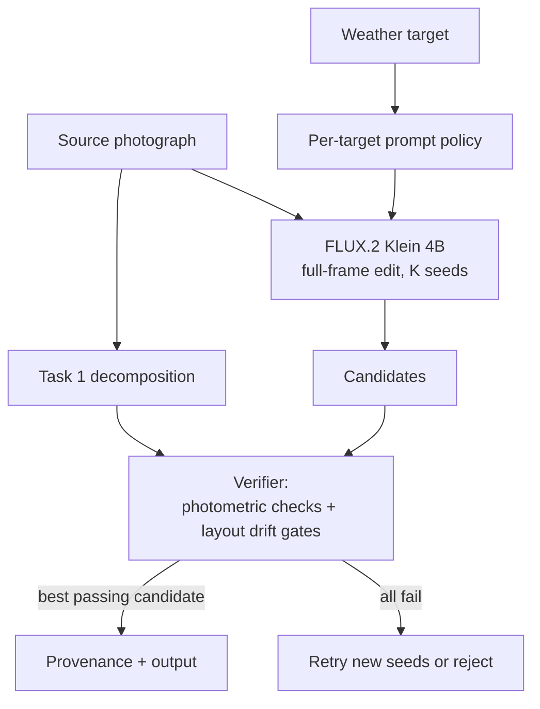

# Task 2: Selective Weather Editing

## Architecture and selected model

**Selected checkpoint:** [`black-forest-labs/FLUX.2-klein-4B`](https://huggingface.co/black-forest-labs/FLUX.2-klein-4B) — a 4B rectified-flow transformer with native image editing, four-step distilled inference, Apache 2.0 license, and a ~13 GiB footprint that fits an L4 beside the perception models. Alternatives: Qwen-Image-Edit-2511 (20B) is strong but needs 40 steps and does not fit an L4 in BF16; FLUX.1 Kontext (12B) is gated and non-commercial; Klein 9B is non-commercial. The choice is an evaluation hypothesis — any replacement must beat it on the frozen weather benchmark.

## Family comparison

| Approach | Edit control | Preservation | Cost | Assessment |
|---|---|---|---|---|
| Latent-diffusion inpainting | Excellent binary spatial control | Exact outside mask; seams at boundaries | Moderate, many denoising steps | Strong sky replacement baseline, weak for global illumination/fog |
| ControlNet-style depth/edge conditioning | Explicit geometry retention | Strong structure if controls are reliable | Extra network and domain training | Add if prompt plus verification cannot preserve geometry |
| Native rectified-flow transformer edit | Understands global instruction and image jointly | Strong semantic consistency, but can drift | Four steps for Klein | Selected candidate generator |
| Large autoregressive/multimodal editor | Strong instruction reasoning | Often strong identity/text behavior | Too large/slow for L4 | Offline teacher/evaluation comparator |

## Generate, verify, select

Rectified flow is a transformer-based family allowed by the brief; its straighter denoising trajectory reaches target latency at four steps. The generator owns every output pixel:

1. **Generate** K full-frame candidates (demo: 4 seeds). No masks are given to the model.
2. **Verify** each candidate against the Task 1 contract: edit strength inside the edit matte, leakage in its complement, edge F1 near the structure guard — plus hard *layout-drift gates* from re-segmenting the candidate: appeared people/vehicles, water turned solid, new water over solid ground. The semantic gates exist because MAE and edge metrics cannot tell "snow on water" from "new land".
3. **Select** the best passing candidate and return it; if none passes, retry new seeds or reject.

**Prompt policy.** The instruction is per-target and tuned on the verifier. A/B runs showed the minimal prompt ("Keep everything the same, except that the weather is rainy.") preserves layout strictly better than a constraint list for rain and fog — the list's wetness clauses primed the model to invent ponds (4/4 seeds failed). Snow is the exception: the minimal prompt froze open sea on every seed (water-loss 0.87–1.0), so snow keeps explicit liquid-water constraints (best 0.006). Lesson: negative instructions can induce the content they forbid, so each clause must earn its place empirically.

The CLI ships two editors behind one protocol: `Flux2KleinEditor` (real Diffusers pipeline) and `MockWeatherEditor` (deterministic, weight-free), both running identical decomposition, verification, and selection.

## Evaluation methodology

Use a scene-disjoint set with real strata for all five targets, hard cases from Task 1, and human acceptability labels. Report metrics per target, scene type, and OOD bucket — never only an average.

| Axis | Automated measurements | Human question |
|---|---|---|
| Edit fidelity | Weather-classifier target margin; CLIP margin; precipitation/wet-surface probes; fog transmission vs. depth | “Is the requested weather unambiguous and coherent?” |
| Preservation | Edge F1 near structure; segment/OCR/identity consistency; layout-drift gates | “Is this unmistakably the same scene?” |
| Realism | KID/FID vs. real target-weather sets; artifact detector; pairwise preference | “Could this be a real photograph?” |
| Safety | Policy classifiers; protected-content drift; provenance presence | “Could this be deceptive in context?” |

The shipped metrics (support-weighted MAE, edge F1, three drift gates) are smoke tests, not substitutes for learned probes.

### Managing the three-way trade-off

Treat it as a constrained Pareto problem, not one weighted score. Preservation and safety are gates calibrated on human acceptability (no object-count/OCR changes, bounded edge displacement, drift gates); among passing candidates, rank edit fidelity and realism. Pixel identity is deliberately not a gate — weather legitimately changes illumination across most of the frame. At runtime: generate a small seed batch, prefer any gate-passing candidate over a higher-scoring failing one; if edit fidelity fails, strengthen the prompt clause; if preservation fails, retry a new seed or reject — never trade identity for a stronger storm.

## Consistency across related inputs

For bursts/video: estimate camera motion and optical flow, warp the previous decomposition and noise initialization into the next frame, share the weather embedding and precipitation trajectory over a short temporal window, and add temporal losses on flow-warped features and edges. Render particles in camera/world coordinates rather than per frame; detect cuts before propagating. For unordered views of one place, share a scene/weather ID and measure cross-view consistency. Single-image requests claim no temporal guarantees.

## Scalability and operations

- Perception as TensorRT FP16/INT8 services; the four-step BF16 generator as a long-lived worker. Batch size one for interactive latency; aspect-bucketed batches offline.
- L4 is the inference baseline (~13 GiB for Klein 4B); CPU offload is a compatibility mode. A100/H100 only for training, distillation, and bulk evaluation.
- Cache decompositions per encrypted job and delete with source data. Queue by pixel count; backpressure before OOM.
- Canary each model version on the frozen suite, then staged traffic with automatic rollback on preservation, safety, or latency regression.

## Misuse controls

Weather editing can fabricate storm/flood evidence, unsafe road conditions, or concealed time/location. Controls: restrict the API to enumerated weather targets (no free text), scan for documentary/evidentiary contexts and block claims-oriented use, rate-limit and audit, attach C2PA provenance plus model/edit metadata, watermark as defense in depth, and disclose synthesis in the UI. High-impact enterprise use requires purpose review and human approval; provenance and policy enforcement remain primary because watermarks alone do not make misuse safe.